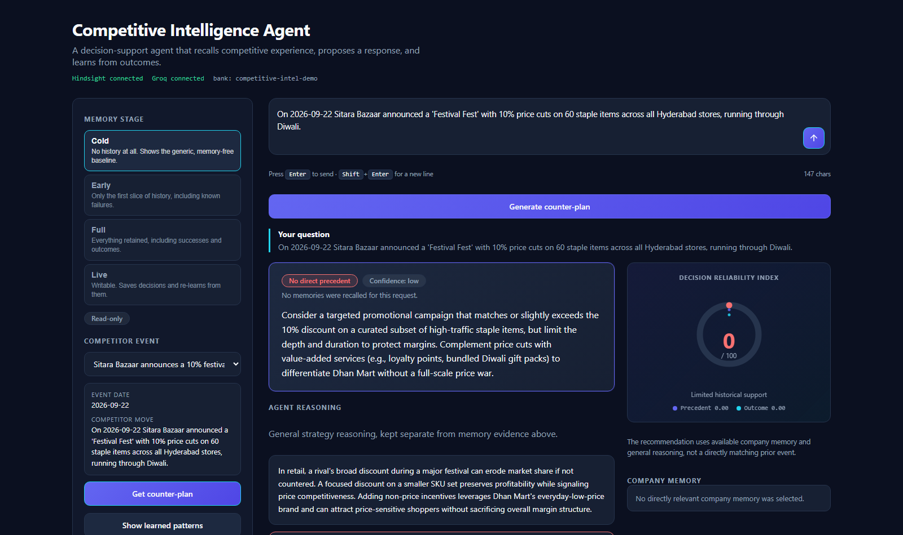
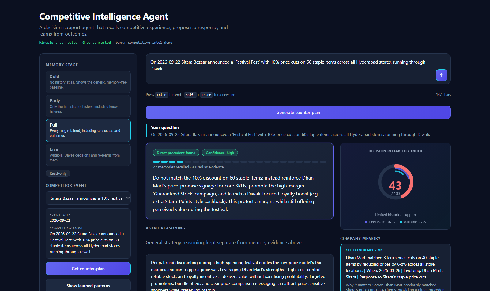
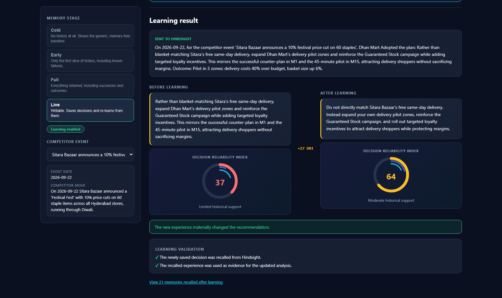

# Competitive Intelligence Agent

**An AI agent that recommends counter-plans against a competitor's moves — and gets
better at it because it remembers your company's own past decisions and whether
they worked.**

Built for the [HackerWithHyderabad 3.0](https://hindsight.vectorize.io/) hackathon
using [Hindsight](https://github.com/vectorize-io/hindsight) (Vectorize) for memory
and [Groq](https://groq.com) for reasoning.

---

## The problem

Most competitive-intelligence tools **watch** the competitor — price pages, press
releases, job posts. That's monitoring, not intelligence. They forget everything the
moment the conversation ends, so they will happily recommend the exact mistake your
company made last quarter.

This agent remembers **your own trial and error**, not just the competitor's activity.

## The proof: same question, opposite answer

<div align="center">

| 🔴 **Cold** — no memory | 🟢 **Full** — full history |
|---|---|
|  |  |
| DRI **0/100** · 0 memories<br>"Launch a targeted promotion with modest discounts (5–7%)" | DRI **43/100** · 22 memories recalled, 4 cited<br>**"Do not match Sitara's 10% discount"** |

</div>

Nothing about the agent was retuned between these two — only the **memory it could
recall** changed. With history, it cites the May attempt where matching Sitara's cuts
**dropped operating margin from 7.9% → 6.6%**, and reaches the opposite conclusion.

## The core loop

1. A new competitor move comes in.
2. The agent recalls similar past moves, *what your company did about them*, and
   **whether that worked**.
3. It proposes a counter-plan, citing exactly which memories it used.
4. You adopt or reject it, optionally record the outcome — and that gets written to
   memory. The next plan learns from it.

## Quickstart

### 1. Configure

```bash
git clone <your-repo-url>
cd Hackathon
python -m venv .venv
.\.venv\Scripts\python.exe -m pip install -r requirements.txt
copy .env.example .env       # Windows
cp .env.example .env         # macOS / Linux
```

Fill in `.env`:

| Key | Where to get it |
|---|---|
| `HINDSIGHT_API_KEY` | [ui.hindsight.vectorize.io](https://ui.hindsight.vectorize.io) → Billing → apply promo `MEMHACK99` for $50 free credit → Create API Key |
| `GROQ_API_KEY` | [groq.com](https://groq.com) (free tier) |

### 2. Seed the memory banks

Each memory stage is a separate Hindsight bank:

```bash
.\.venv\Scripts\python.exe seed_hindsight.py cold
.\.venv\Scripts\python.exe seed_hindsight.py early
.\.venv\Scripts\python.exe seed_hindsight.py full
.\.venv\Scripts\python.exe seed_hindsight.py live
```

### 3. Run it

**React UI (recommended)** — two terminals:

```bash
# terminal 1
.\.venv\Scripts\python.exe -m uvicorn server:app --port 8000

# terminal 2
cd frontend && npm install && npm run dev    ->  http://localhost:5173
```

**Streamlit UI** (single-file fallback):

```bash
.\.venv\Scripts\python.exe -m streamlit run app.py
```

## Memory stages

The point of the whole demo is the contrast between these:

| Stage | Memories | Behaviour |
|---|---|---|
| **Cold** | 0 | Generic, sensible advice. `⚠️ No direct precedent`, DRI 0. |
| **Early** | 10 | Partial history, including known failures. |
| **Full** | 18 | Everything, including successes and outcomes. |
| **Live** | 18 + your decisions | **Writable.** Saves decisions and re-learns. |

Same question at Cold vs Full gives **opposite recommendations** — that is the demo.

## Decision Reliability Index (DRI)

Every recommendation carries a measured reliability score, not a vague confidence label:

```
DRI = 100 × (0.6 × P + 0.4 × O)
```

- **P — precedent**: the highest Hindsight reranker score for this query (retrieval confidence).
- **O — outcome**: fraction of recalled decision-memories that carry explicit outcome
  evidence (were decisions followed by measured results?).

It's regex-based and deterministic rather than LLM-based, so the number stays fast and
reproducible instead of adding latency and noise to something the UI presents as a
measurement.

## Architecture

```
React UI (frontend/) ──or── Streamlit UI (app.py)
        │                            │
        └──────── FastAPI (server.py) ┘
                        │
                  agent.py  ── recall/reflect/retain ──> Hindsight Cloud
                        │                               (memory banks)
                        └──── ask_llm (Groq) ─────────> openai/gpt-oss-120b
```

The memory logic lives in `agent.py` and `dri.py` **only**. Both UIs call into it, so
they can never disagree. `server.py` is a thin HTTP layer — it adds no memory logic of
its own.

**Why React exists:** Streamlit cannot stream incremental progress from a single button
click, so the 7-step learning cycle painted all its steps at once and read as a canned
animation. `server.py` emits each step over **Server-Sent Events** the moment the real
backend call it represents finishes.

## The learning cycle

Saving a decision in Live runs the real cycle, streamed live:

1. Save decision to Hindsight
2. Decision saved to Live memory
3. Recall updated experience
4. Updated experience recalled
5. Re-evaluate with Groq
6. Updated recommendation generated
7. Learning complete

It then shows **before vs after** recommendations, each with its own DRI, plus two
validation checks confirming the newly saved decision was genuinely recalled and
actually used as evidence.



## Project layout

| File | Purpose |
|---|---|
| `agent.py` | Recall, reasoning, evidence citation, learning cycle. Single source of truth. |
| `dri.py` | Decision Reliability Index calculation. |
| `server.py` | FastAPI wrapper + SSE streaming for the learning cycle. |
| `app.py` | Streamlit UI (alternative frontend). |
| `frontend/` | React 18 + Vite + TypeScript UI. |
| `synthetic_data.py` | 18 dated memory records + demo competitor events. |
| `seed_hindsight.py` | Populates the per-stage memory banks. |
| `GUIDE.md` | Full build & test guide — architecture, test plan, verified outputs, rubric mapping. |

## Try these prompts

| Prompt | What it demonstrates |
|---|---|
| The built-in *"10% festival price cut"* event at Cold, then at Full | Same question, opposite advice — memory changes the answer |
| *"Sitara Bazaar just launched free same-day home delivery above Rs 499. Should we match it?"* (Live) | Partial memory overlap → learns from your outcome, DRI moves |
| *"How should we respond if Sitara opens a warehouse in Warangal?"* | Honest fallback — admits no precedent instead of inventing one |

## Notes & limitations

- Groq output is non-deterministic: which memories get cited, and the exact DRI, vary
  between runs. Evidence citations are validated against what was actually recalled,
  and confidence is programmatically capped when evidence is thin.
- The dataset is **synthetic but realistic** (real-sounding company, real margin and
  footfall numbers) so the agent has a genuine history to reason over.
- See `GUIDE.md` section 5 for the full list of known limitations.

---

📖 **Looking for depth?** See [`GUIDE.md`](GUIDE.md) for the full architecture, a
step-by-step UI test plan, verified real-run outputs, and the rubric mapping.

## License

MIT — see [LICENSE](LICENSE).

All companies, people, and figures in the demo dataset are fictional.
